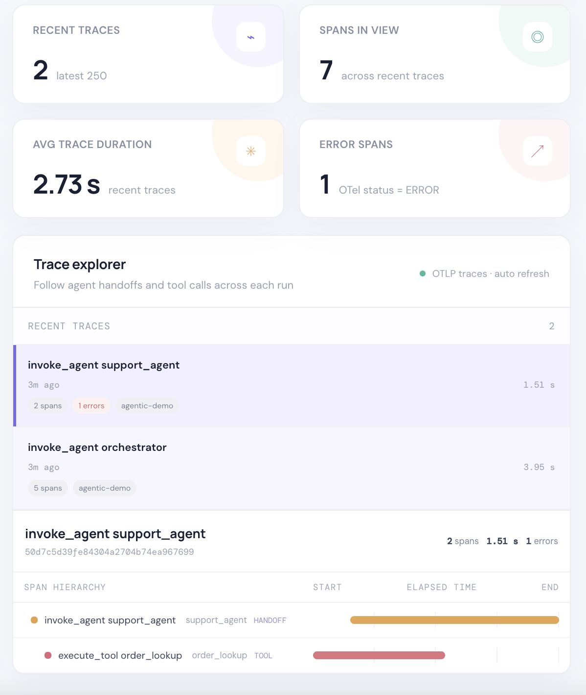

# Agentic Telemetry (alpha)

A lightweight, local-first viewer for OpenTelemetry traces from agentic systems. The only telemetry ingestion endpoint accepts OTLP/HTTP JSON trace requests; custom event payloads are not accepted.

## Run the service

```sh
python3 server.py
```

By default, the service listens on `http://127.0.0.1:8000` and creates `telemetry.db` in the current working directory. Configure `TELEMETRY_HOST`, `TELEMETRY_PORT`, or `TELEMETRY_DB` to change these defaults.

On startup, an empty span database is seeded with two demo OTLP traces that show agent handoffs, tool calls, and an error. Existing trace data is left as-is. Set `TELEMETRY_DEMO_DATA=0` to disable this for a fresh database.

Open `http://127.0.0.1:8000/` to view the dashboard. It lists recent traces and renders each trace as a parent-child span tree with a timing waterfall. Agent calls, handoffs, LLM calls, tool calls, and error spans are highlighted. The view refreshes every 10 seconds.

## Dashboard preview



## Send OpenTelemetry traces

The only telemetry ingestion endpoint is `POST /v1/traces`. It accepts OTLP/HTTP JSON in the `ExportTraceServiceRequest` shape (`resourceSpans` → `scopeSpans` → `spans`). Trace IDs, span IDs, parent IDs, timestamps, resource `service.name`, span attributes, and span events are stored. Re-sending a span with the same trace and span IDs updates it, supporting exporter retries.

Save an OTLP JSON export as `trace.json` and send it:

```sh
curl -X POST http://127.0.0.1:8000/v1/traces \
  -H 'Content-Type: application/json' \
  --data-binary @trace.json
```

Configure an OTel exporter or collector to send HTTP JSON to `http://127.0.0.1:8000/v1/traces`. This alpha endpoint does not accept OTLP/gRPC, binary Protobuf, or custom event formats.

Trace summaries are available from `GET /v1/traces?limit=100`; fetch spans for a trace with `GET /v1/traces?trace_id=<trace-id>`. Use `GET /health` for a health check.

## Agent span visualization

The trace tree is built from each span's `traceId`, `spanId`, and `parentSpanId`. Agent and tool labels are inferred from span names and attributes such as `gen_ai.operation.name`, `gen_ai.agent.name`, and `gen_ai.tool.name`. Handoffs are highlighted when represented by `invoke_agent` spans or names/events/attributes such as `agent.handoff`, `agent.to`, or `handoff.to`.

Avoid sending sensitive prompt or tool payload attributes unless you have explicitly chosen to capture them.

This is a minimal alpha release. Authentication, retention policies, distributed deployment, OTLP/gRPC, binary Protobuf, and metric aggregation are not included. The service listens on the loopback address by default for local development.
